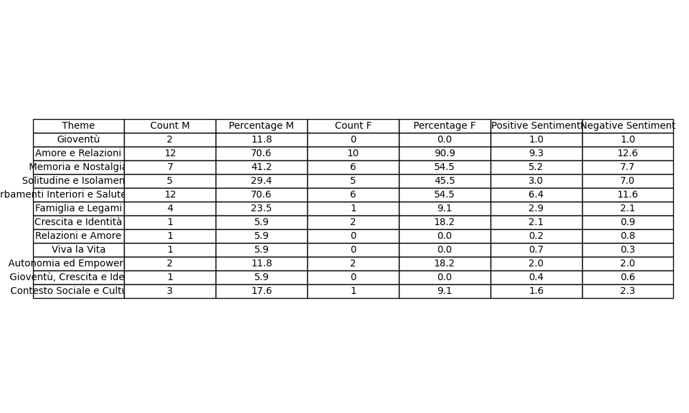
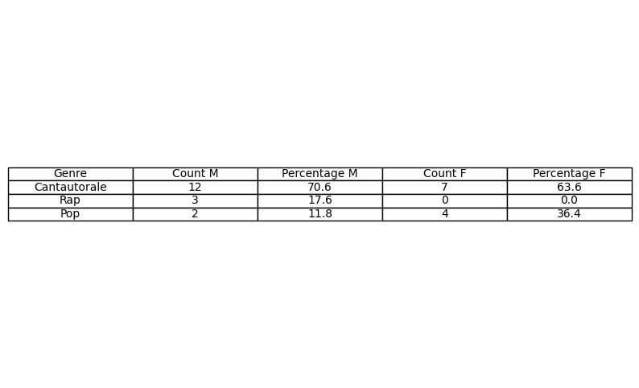
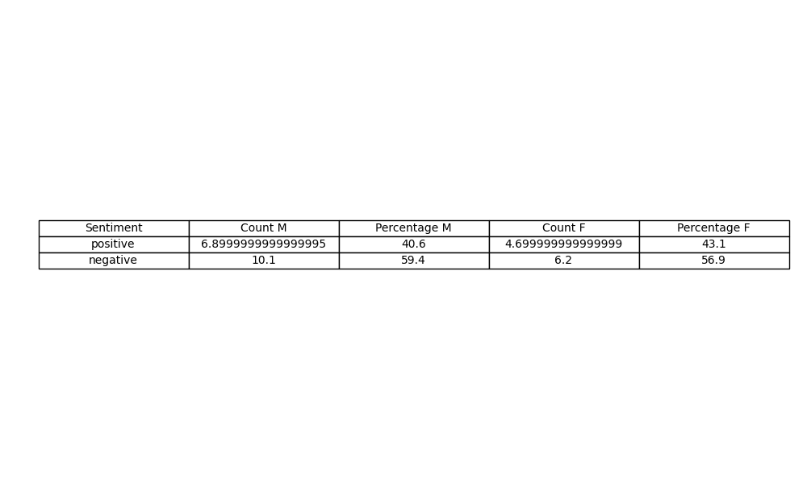
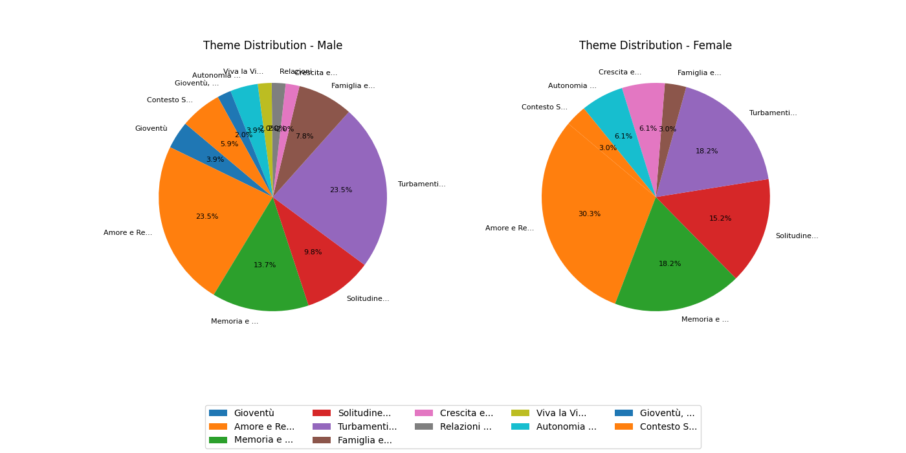
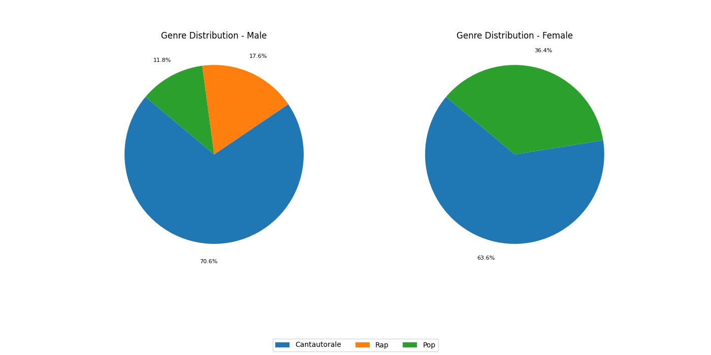
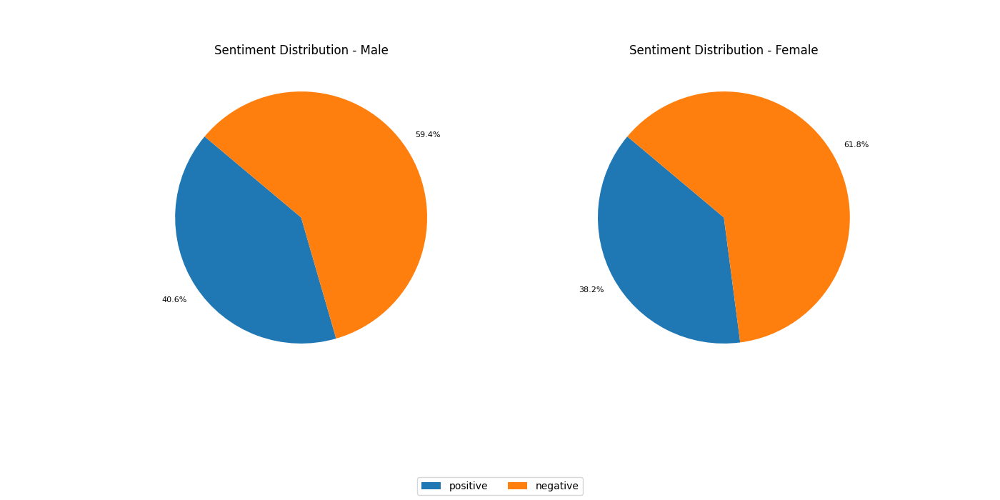

# Sanremo Music Festival Analysis

For the first time in my life I decided to watch the Sanremo Music Festival, and I noticed that most of the songs were about love. I was curious to know if this was indeed an objective truth, so I decided to analyze the songs from the 2025 edition using AI to see if my observation was correct.

## Data Collection

I manually collected online the songs titles and lyrics from the 2025 edition of the Sanremo Music Festival. Then I manually added a "biogender" label indicating the artist biological gender. I labelled groups by the majority with one exception: "Coma_Cose" is a duo composed in equal parts.

## Pre-rendered Tables and Pies

### Theme Table


### Genre Table


### Sentiment Table


### Theme Distribution


### Genre Distribution


### Sentiment Distribution


## Project Structure

- `sanremo.json`: Contains the collected song lyrics and metadata.
- `ai.py`: Uses OpenAI to classify songs and perform sentiment analysis.
- `plot.py`: Creates graphs to visualize the data.
- `.env`: Stores environment variables, including the OpenAI API key.

## How to run

### Setup

1. Clone the repository.
2. Create a virtual environment and activate it:
   ```sh
   python -m venv .venv
   source .venv/bin/activate  # On Windows use `.venv\Scripts\activate`
   ```
3. Install the required packages:
   ```sh
   pip install -r requirements.txt
   ```
4. Add your OpenAI API key to the `.env` file:
   ```dotenv
   OPENAI_API_KEY=your_openai_api_key
   ```

### Usage

#### Classify Songs

To classify songs with themes and perform sentiment analysis, run:
```sh
python ai.py
```
This script will update the `sanremo.json` file with the classification results.

To extract the common themes and genres add the --labels flag:
```sh
python ai.py --labels
```
This script will update the `labels.json` file.

#### Generate Visualizations

To generate visualizations of the data, run:
```sh
python plot.py
```
This script will create graphs and save them in the `generated` directory.

## Description

- **ai.py**: This script loads the song lyrics from `sanremo.json`, calls the OpenAI API to classify each song with themes and sentiment analysis, and updates the JSON file with the results.
- **plot.py**: This script loads the classified data, counts the themes, calculates percentages, and generates visualizations such as tables and pie charts to represent the distribution of themes and sentiments.

## Conclusion

This project provides insights into the themes in the Sanremo Music Festival songs, confirming the initial observation of the prevalence of love songs and unlocking other interesting patterns. The visualizations help to understand the distribution of themes, genres, and sentiments in the songs, including the gender differences, providing a comprehensive overview of the festival's music.