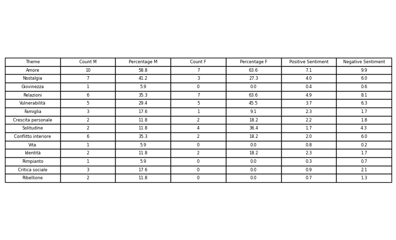
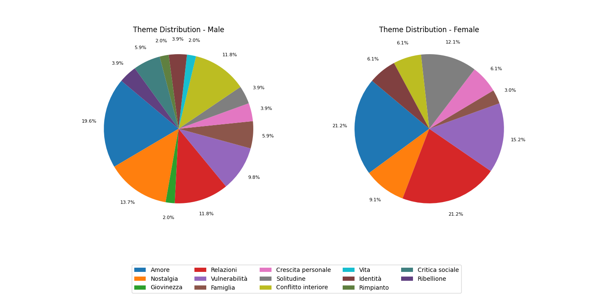

# Sanremo Music Festival Analysis

This project aims to analyze the prevalence of love songs in the Sanremo Music Festival 2025. The analysis involves collecting song lyrics, using AI to extract common themes and sentiments, and visualizing the data through various graphs.

## Pre-rendered Tables and Pies

### Theme Table


### Genre Table


### Sentiment Table


### Theme Distribution


### Genre Distribution


### Sentiment Distribution


## Project Structure

- `sanremo.json`: Contains the collected song lyrics and metadata.
- `ai.py`: Uses OpenAI to classify songs with appropriate themes and perform sentiment analysis.
- `plot.py`: Creates graphs to visualize the data.
- `.gitignore`: Specifies files and directories to be ignored by Git.
- `.env`: Stores environment variables, including the OpenAI API key.

## Setup

1. Clone the repository.
2. Create a virtual environment and activate it:
   ```sh
   python -m venv .venv
   source .venv/bin/activate  # On Windows use `.venv\Scripts\activate`
   ```
3. Install the required packages:
   ```sh
   pip install -r requirements.txt
   ```
4. Add your OpenAI API key to the `.env` file:
   ```dotenv
   OPENAI_API_KEY=your_openai_api_key
   ```

## Usage

### Classify Songs

To classify songs with themes and perform sentiment analysis, run:
```sh
python ai.py
```
This script will update the `sanremo.json` file with the classification results.

### Generate Visualizations

To generate visualizations of the data, run:
```sh
python plot.py
```
This script will create graphs and save them in the `generated` directory.

## Description

- **ai.py**: This script loads the song lyrics from `sanremo.json`, calls the OpenAI API to classify each song with themes and sentiment analysis, and updates the JSON file with the results.
- **plot.py**: This script loads the classified data, counts the themes, calculates percentages, and generates visualizations such as tables and pie charts to represent the distribution of themes and sentiments.

## Conclusion

This project provides insights into the themes and sentiments prevalent in the Sanremo Music Festival songs, confirming the initial observation of the prevalence of love songs.